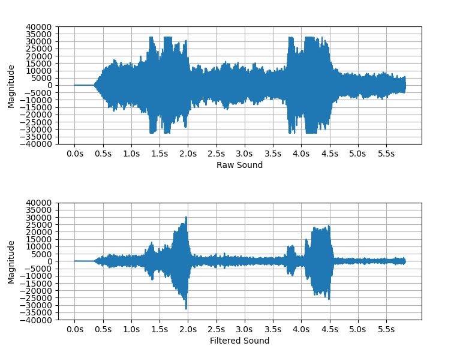

# 2019-2-CECD1-FanDu-1

* 컴퓨터공학 종합설계_2 팀 판듀(FantasticDuo) 프로젝트 저장소 입니다.

### 팀원

<pre>
팀장 : 백수현
팀원 : 남정욱
</pre>

## 프로젝트

드론의 소음 제거를 통한 구조 음성 인식률 향상  

## 개발 환경

* OS : Windows 10

* 사용언어 : Python 3.7

* 사용모듈 : numpy, scipy, matplotlib, speech_recognition, math, os

* 개발툴 : Visual Studio Code, Jupyter Notebook, google Colab

* 구동 환경 : 라즈베리파이 3B // Windows 플랫폼에서도 가능

* 테스트 드론 타입 : Helsel Zealot-X Standard	   

## 설치하기

* clone
<pre>
$ git clone https://github.com/CSID-DGU/2019-2-CECD1-FanDu-1
</pre>

* 패키지 설치하기
<pre>
$ cd 디렉터리내부
$ pip install --upgrade pip
$ pip install -r requirements.txt
</pre>

<pre>
- python3 설치되어 있다고 가정
- 환경에 따라 특정 패키지가 설치되어 있지 않을 경우 개별 설치 필요</pre>   
 
## <u> **source code 설명** </u>
<pre>
 - run.py : 녹음된 파일을 실행하는 모듈
 - run_RT.py : 마이크로 입력된 실시간 음성을 실행하는 모듈
 - noise_rd.py : 소음 제거 수행 모듈 // run, run_RT에서 사용   

## 디렉터리 설명
<pre>
- input : run 모듈 실행 시 입력 *.wav 파일 입력 받아오는 폴더
- output : run 모듈 실행 시, 소음 제거 수행 후 *.wav 파일 출력하는 폴더
- signal : run 모듈 실행 후 구조요청이라 판단시*.wav 파일 출력하는 폴더</pre> 
<pre>
- RT_output : run_RT 모듈 실행 시, 소음 제거 수행 후 *.wav 파일 출력하는 폴더
- RT_signal : run_RT 모듈 실행 후 구조요청이라 판단시*.wav 파일 출력하는 폴더
</pre>   

## 실행하기
<pre>
- 두 가지 실행 방식이 있습니다.
1.  녹음된 파일로 실행,  2. 실시간으로 실행</pre>/br>
<ol>
<li> 녹음된 파일 실행 </li> 
<pre>
    - $ python run.py 
    - input 폴더에 있는 wav 파일을 입력으로 받아 output 폴더에 출력</pre> 

<li> RT(realtime) 실행 </li> 
<pre>
    - $ python run_RT.py 
    - 콘솔창에 "wait for speaking"이라고 뜨면 마이크를 통해 wav 파일을 입력으로 받아 RT_output 폴더에 출력</pre>   
</ol>

## 실행결과

▲  -   "도와주세요.wav"    Before/After waveform example  

▲  -   "구해주세요"    Before/After waveform example   

## 프로젝트 설명
 
- 소개 영상(3:48) : https://youtu.be/7fW_0DiFdU4   
- 시연 영상(1:14) : https://youtu.be/jJ02XZmbc-k  
