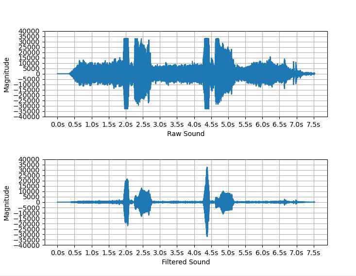

# 2019-2-CECD1-FanDu-1

* 컴퓨터공학 종합설계_2 팀 판듀(FantasticDuo) 프로젝트 저장소 입니다.

### 팀원

<pre>
팀장 : 백수현
팀원 : 남정욱
</pre>

### 프로젝트

드론의 소음 제거를 통한 구조 음성 인식률 향상

### 개발 환경

* OS : Windows 10

* 사용언어 : Python 3.7

* 사용모듈 : numpy, scipy, matplotlib, speech_recognition, math, os

* 개발툴 : Visual Studio Code, Jupyter Notebook, google Colab

* 구동 환경 : 라즈베리파이 3B // Windows 플랫폼에서도 가능

* 테스트 드론 타입 : Helsel Zealot-X Standard	

## 설치하기

* clone
<pre>
$ git clone https://github.com/CSID-DGU/2019-2-CECD1-FanDu-1
</pre>

* 패키지 설치하기
<pre>
$ cd 디렉터리내부
$ pip install --upgrade pip
$ pip install -r requirements.txt
</pre>

- python3 설치되어 있다고 가정
- 환경에 따라 특정 패키지가 설치되어 있지 않을 경우 개별 설치 필요
 
## 실행하기
- 두 가지 실행 방식이 있습니다.
- 1) 녹음된 파일로 실행, 2) 실시간으로 실행

1) 녹음된 파일 실행
 -$ python run.py
- input 폴더에 있는 wav 파일을 입력으로 받아 output 폴더에 출력

2) RT(realtime) 실행
-$ python run_RT.py
- 콘솔창에 "wait for speaking"이라고 뜨면 마이크를 통해 wav 파일을 입력으로 받아 RT_output 폴더에 출력

## 실행결과

▲  -   "도와주세요.wav" before/after waveform example 

[alt image](waveform/guhea_ex.png)

▲  -   "구해주세요" before/after waveform example 

## 프로젝트 설명
 
- 소개 영상(4:24) : https://www.youtube.com/watch?v=XPzpoxqYBM8&feature=youtu.be
- 시연 영상(1:14) : https://www.youtube.com/watch?v=Jqven9-wE_A&feature=youtu.be 